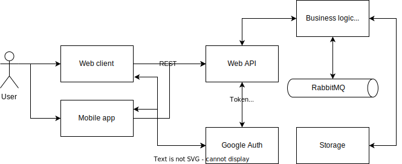

<!--
## Реляційна схема

-->

# Big Picture

# Deployment

# Components

# ER Model

@startuml

entity User <<ENTITY>>{
    Name: TEXT
    Email: TEXT
    Password: TEXT
    Salt: TEXT
    Authorization_Token: TEXT
}

entity Organization <<ENTITY>>{
    Name: TEXT
    Creation_date: DATE
    Creator: TEXT
    Description: TEXT
    Picture: IMAGE
    Address: TEXT
}

entity PollType <<ENTITY>>{
    Name: TEXT
    Description: TEXT
}

entity BlackListedUser <<ENTITY>>{
    BL_User: TEXT
    BL_Poll: TEXT
}

entity WhiteListedUser <<ENTITY>>{
    WL_User: TEXT
    WL_Poll: TEXT
}

entity Poll <<ENTITY>>{
    Title: TEXT
    Description: TEXT
    CreationDate: DATE
    End_Date: TEXT
    IsWhiteList: BOOL
    IsBlackList: BOOL
    IsPrivate: BOOL
    Link: TEXT
    Type: TEXT
}

entity QuestionType <<ENTITY>>{
    Name: TEXT
    Description: TEXT
}

entity AnswerOption <<ENTITY>>{
    Name: TEXT
    Index: NUMBER
}
entity Question <<ENTITY>>{
    Title: TEXT
    Description: TEXT
    Type: TEXT
}

entity Answer <<ENTITY>>{
    Content: TEXT
    Question: TEXT
    QuestionType: TEXT
}

entity PollResult <<ENTITY>>{
    Date: DATE
    PR_Comment: TEXT
    Respondent: TEXT
}

entity QuestionFeedback <<ENTITY>>{
    QF_Comment: TEXT
    QF_Qeustion: TEXT
}

entity PollFeedback <<ENTITY>>{
    GeneralComment: TEXT
    Rating: NUMBER
    MaxRating: NUMBER
    Reviewer: TEXT
    PF_Poll: TEXT
}

Poll "0,*"--*"1,1" User
Organization "0,*"--*"1,1" User
PollFeedback "0,*"--*"1,1" User

Poll "0,*"--*"1,1" Organization

BlackListedUser "1,1"*--"0,*" User
BlackListedUser "1,1"--*"0,*" Organization

WhiteListedUser "1,1"*--"0,*" User
WhiteListedUser "1,1"--*"0,*" Organization

Question "0,*"--*"1,1" Poll

Answer "0,*"--*"1,1" Question
Answer "0,*"--*"1,1" PollResult

AnswerOption "0,*"--*"1,1" Question
PollType "0,*"-d-*"1,1" Poll
QuestionType "0,*"--*"1,1" Question
QuestionType "0,*"--*"1,1" Answer

QuestionFeedback "0,*"--*"1,1" PollFeedback

@enduml

