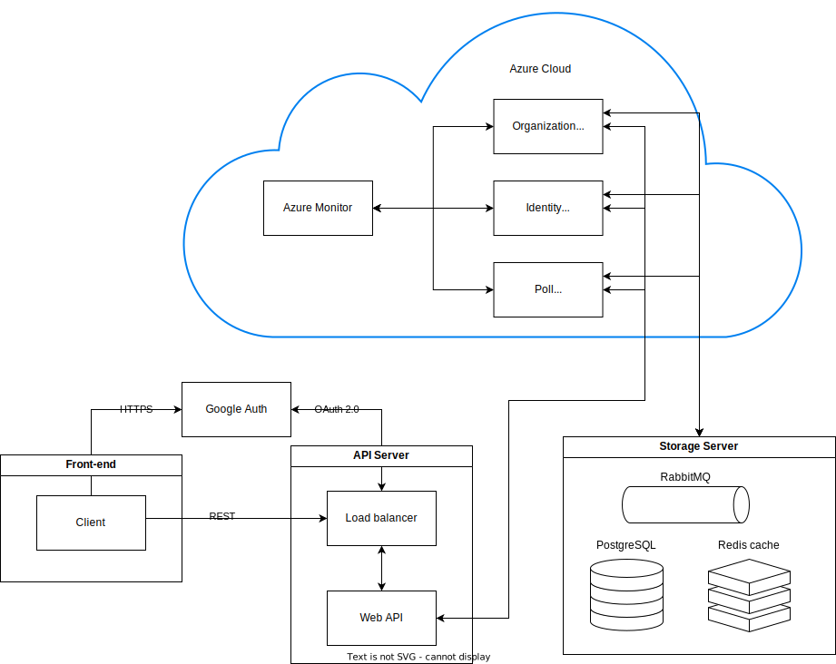

# Проектування інформаційного забезпечення

В цьому документі наведені діаграми, у яких відображено компоненти та існуючі технічні рішення, які будуть використані для побудови майбутньої системи, а також архітектуру розроблюваного програмного забезпечення.

## Big Picture

## Deployment

## Components

## ER Model

@startuml

entity User {
    Name: TEXT
    Email: TEXT
    Password: TEXT
    Salt: TEXT
    Authorization_Token: TEXT
}

entity Organization {
    Name: TEXT
    Creation_date: DATE
    Creator: TEXT
    Description: TEXT
    Picture: IMAGE
    Address: TEXT
}

entity PollType {
    Name: TEXT
    Description: TEXT
}

entity BlackListedUser {
    BL_User: TEXT
    BL_Poll: TEXT
}

entity WhiteListedUser {
    WL_User: TEXT
    WL_Poll: TEXT
}

entity Poll {
    Title: TEXT
    Description: TEXT
    CreationDate: DATE
    End_Date: TEXT
    IsWhiteList: BOOL
    IsBlackList: BOOL
    IsPrivate: BOOL
    Link: TEXT
    Type: TEXT
}

entity QuestionType {
    Name: TEXT
    Description: TEXT
}

entity AnswerOption {
    Name: TEXT
    Index: NUMBER
}
entity Question {
    Title: TEXT
    Description: TEXT
    Type: TEXT
}

entity Answer {
    Content: TEXT
    Question: TEXT
    QuestionType: TEXT
}

entity PollResult {
    Date: DATE
    PR_Comment: TEXT
    Respondent: TEXT
}

entity QuestionFeedback {
    QF_Comment: TEXT
    QF_Qeustion: TEXT
}

entity PollFeedback {
    GeneralComment: TEXT
    Rating: NUMBER
    MaxRating: NUMBER
    Reviewer: TEXT
    PF_Poll: TEXT
}

Poll "0,*"-->"1,1" User
Organization "0,*"-->"1,1" User
PollFeedback "0,*"-->"1,1" User

Poll "0,*"-->"1,1" Organization

BlackListedUser "1,1"<--"0,*" User
BlackListedUser "1,1"<--"0,*" Organization

WhiteListedUser "1,1"<--"0,*" User
WhiteListedUser "1,1"<--"0,*" Organization

Question "0,*"-->"1,1" Poll

Answer "0,*"-->"1,1" Question
Answer "0,*"-->"1,1" PollResult

AnswerOption "0,*"-->"1,1" Question
PollType "0,*"-->"1,1" Poll
QuestionType "0,*"-->"1,1" Question
QuestionType "0,*"-->"1,1" Answer

QuestionFeedback "0,*"-->"1,1" PollFeedback

@enduml

