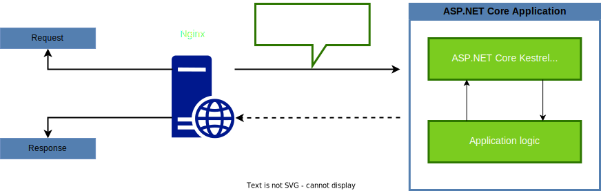

# Технологічний стек

Система Survey Expert будуватиметься з використанням найновіших та водночас стабільних технологій, що доступні на ринку. Усі використані технології мають відкритий вихідний код та є безкоштовними. Також усі ці технології мають постійну підтримку зі сторони корпорацій та користувачів.

## Business Logic Microservices

Хоча й концепція мікросервісів дозволяє будувати кожен з них використовуючи довільні технології, в рамках цього проекту ми будемо використовувати для них спільні технології. Усі мікросервіси будуть написані мовою C# на платформі .NET. Оскільки інтерфейс взаємодії з сервісами буде побудовано на ASP.NET Core, основою додатку стане ABP Framework. Для комунікації між мікросервісами буде використано шину подій RabbitMQ та бібліотеку MassTransit для зручної взаємодії з нею.

### Microsoft .NET
Платформа .NET вже понад 20 років займає одну з лідуючих позицій в ентерпрайз розробці та вирізняється швидкодією, ефективністю та легкістю написання коду з використанням мови C# та потужних офіційних бібліотек, а також наявністю безлічі сторонніх бібліотек та фреймворків.

**Pros:**

- ● Надійна платформа з підтримкою від однієї з найбільших IT компаній світу
- ● .NET пропонує розроблення кросплатформених додатків
- ● Відкритий вихідний код платформи
- ● Велика кількість офіційних та 3rd-party бібліотек та надбудов з хорошою підтримкою ком'юніті
- ● Вбудована система збірки сміття (Garbage collector)
- ● Мова C# швидко розвивається, адаптуючи різні парадигми та стилі, і станом на сьогоднішній день дозволяє писати у ООП, функціональному, реактивному та декларативному стилях

**Cons:**

- ● Великий поріг входу порівняно з деякими іншими популярними ентерпрайз платформами
- ● Корпорація Microsoft часто відмовляється від своїх продуктів та оголошує їх застарілими
- ● Хоч і на сьогодення .NET є кросплатформеним рішенням, воно все ж залишається більш Windows-орієнтованим, надаючи найбільше можливостей розробниками під ОС Windows
- ● Для деяких компаній вартість ліцензій продуктів Microsoft може бути значною

### ABP Framework
ABP Framework — це повна інфраструктура для створення сучасних веб-додатків із дотриманням найкращих практик і умов розробки програмного забезпечення. ABP об’єднує та розширює цілу низку бібліотек та платформ, значно прискорюючи розробку за рахунок готових рішень та зручних розширень. Цей фреймворк стане основою для побудови зручної та потужної мікросервісної архітектури. Також він буде використаний на фронтенді для полегшення розробки на Angular та кращої інтеграції з ASP.NET Core.

**Pros:**

- ● Об’ємна база готових рішень, що постійно доповнюються та оновлюються
- ● Продумана структура, що легко розширюється та модифікується
- ● Підтримує найновіші методики з побудови сучасної архітектури

**Cons:**

- ● Зазвичай розробники, яких щойно прийняли у команду, вивчають фреймворк з нуля або зовсім трохи знайомі з ним
- ● Через велику кількість оновлення кодової бази, документація часто не встигає оновлюватись, та доводиться розбиратись з проблемами вивчаючи вихідний код або за допомогою офіційної підтримки, що є затратним по часу
- ● Значна частина готових модулів доступна лише за додаткову оплату, що накладе додаткові обмеження на бюджет проекту

### RabbitMQ
Шина подій RabbitMQ чудово підходить для проекту нашого масштабу, оскільки добре справляється саме з середніми, по міркам індустрії, навантаженнями. Зручний інтерфейс взаємодії, надійність та безпечність цього брокеру заслужили довіру багатьох компаній. Проект отримує постійні малі та великі оновлення, та є безпечним для використання у довгостроковій перспективі.

**Pros:**

- ● Широка розповсюдженість брокеру полегшує вирішення проблем
- ● Якість та безпека шини зарекомендували себе на ринку та є перевірені часом
- ● Добре підходить для нашого проекту за співвідношенням складність/продуктивність

**Cons:**

- ● Брокер найкраще працює на середніх та низьких навантаженнях, але програє на великих навантаженнях
- ● Важче масштабується, ніж наприклад Kafka

### MassTransit
Бібліотека для платформи .NET, яка значно полегшує використання протоколів обміну повідомленнями, та надає багато якісних та продуманих абстракцій для роботи з ними. Бібліотека підтримує різні види брокерів, в нашому випадку ми будемо використовувати RabbitMQ.

**Pros:**

- ● Значно пришвидшує швидкість розробки, зменшуючи кількість церемоній та шаблонного коду, а також надаючи готові рішення частих задач мессенджингу
- ● Збільшує надійність коду, оскільки не доводиться щоразу «винаходити колесо»

**Cons:**

- ● Складніше набирати команду, оскільки не всім цікаво занурюватись у специфічну технологію
- ● Підвищує поріг входу у проект через дещо складні абстракції

## Web API

### ASP.NET Core
Одна з найбільших веб-платформ на ринку та найкращий варіант для розробки на платформі .NET. Фреймворк має дуже хорошу офіційну підтримку, постійно росте та розвивається, адаптуючись під останні віяння індустрії. У нашому проекті послугує основним інтерфейсом взаємодії бізнес сервісів з фронтендом. За основу буде взято ASP.NET Core Web API.

**Pros:**

- ● Найкращі показники швидкодії APIs серед інших конкурентоспроможних платформ
- ● Вбудована можливість використання DI-контейнеру
- ● Найкращий варіант веб-платформи для інтеграції з .NET
- ● Якісна кодова база та постійна підтримка від Microsoft

**Cons:**

- ● Через кросплатформеність рішення, відсутня підтримка Windows-орієнтованих бібліотек та можливостей
- ● Платформа продовжує зростати, екосистема нарощується, деякі функції, що були доступні у попередній версії фреймворку, можуть застаріти вже у наступній, але об'язково матимуть аналогічне підтримуване рішення

### Nginx
Найбільший безкоштовний open-source HTTP-сервер та reverse proxy. Він буде виконувати роль балансувальника та візьме на себе все навантаження з прийому запитів від користувачів (reverse proxy), значно полегшуючи роботу основного веб-сервера ASP.NET Core Kestrel та запобігаючи перенавантаження.

**Pros:**

- ● В основі архітектури покладено неблокуючі операції та подійно-орієнтовану модель, що потребує невелике використання CPU та RAM для обслуговування HTTP-запитів
- ● Надає необхідний рівень безпеки та механізми керування веб-застосунком
- ● Вбудований балансувальник запитів
- ● Є кросплатформеним, але водночас орієнтований під Linux

**Cons:**

- ● Трохи повільніша обробка динамічного контенту, ніж у Apache
- ● Недостатня кількість інструментів для моніторингу. Сервер просто записує логи у файли, які доводиться аналізувати вручну або через 3rd party утиліти
- ● Достатньо складний у налаштуванні

## Storage

Для забезпечення персистентності в проекті буде використовуватись як реляційна БД для бізнес даних, так і неструктуроване сховище для кешу та проміжних даних.

### PostgreSQL
Ця СУБД була обрана як найнадійніша та найпотужніша з безкоштовних СУБД для реляційних БД. Її імплементація доступна на різних ОС. PostgreSQL добре підходить для середніх та великих ентерпрайз додатків. У нашому додатку використовуватиметься для зберігання бізнес сутностей та зв’язків між ними.

**Pros:**

- ● Має широкий функціонал, що подекути навіть ширший від пропрієтарних варіантів
- ● Безкоштовне рішення з відкритим вихідним кодом не накладатиме додатковий тягар на бюджет проекту
- ● Добре інтегрується з Entity Framework Core
- ● Доступний для багатьох ОС, не буде обмежувати вибір хостингу

**Cons:**

- ● Має меншу кількість навчальних матеріалів, ніж пропрієтарні СУБД, оскільки не має такого ж фінансування

### Redis
Redis це резидентна система управління базами даних класу NoSQL з відкритим вихідним кодом, що працює зі структурами даних типу "ключ - значення". Використовується як для баз даних, так реалізації кешів, брокерів повідомлень. Орієнтована досягнення максимальної продуктивності на атомарних операціях. У нашому додатку буде використовуватись для зберігання кешів та проміжних даних.

**Pros:**

- ● Має найкращі показнити швидкодії серед аналогів для рішення задачі кешування
- ● Майже відсутній час простою або вплив на продуктивність під час масштабування
- ● Пропонує базові можливості безпеки (права доступу) на рівні екземпляра
- ● Дуже проста у налаштуванні та обслуговуванні
- ● Доступна для багатьох ОС, не буде обмежувати вибір хостингу

**Cons:**

- ● Конкретний Redis instance не можна масштабувати. Він працює лише на одному ядрі процесора в однопоточному режимі, тому щоби отримати масштабованість, потрібно розгорнути та запустити кілька екземплярів Redis
- ● Не має можливості просто взяти і внести дані в Redis. Потрібно заздалегідь передбачити які дані буде зберігати застосунок та як вони будуть структуровані між Redis instance

## Frontend

### Angular
Angular — відкрита та безкоштовна платформа для розробки веб-додатків, написана на мові TypeScript, що розробляється командою компанії Google, а також спільнотою розробників різних компаній. Ця платформа надає усе необхідне для швидкої розробки SPA та буде використана для написання веб-клієнту нашого проекту.

**Pros:**

- ● Велика кількість готових безкоштовних та пропрієтарних компонентів та бібліотек
- ● Якісна комплектація, все працює "з коробки", що також полегшує підтримку проекту та набір інженерів
- ● Кросплатформене надання інтерфейсу, залежно від клієнта
- ● Простота та лаконічність коду, легкість перевикористання компонентів програми
- ● Детальна документація та велика кількість навчальних матеріалів
- ● Зрілість технології порівняно з більшістю сучасних фронтенд технологій

**Cons:**

- ● Складність технології, що підвищує поріг входу в проект та ускладнює вирішення проблем, пов’язаних з компілятором та середовищем виконання Angular
- ● Подекуди складніше модифікувати через нав’язливість вбудованих компонентів

### Uno Platform
Найбільш зрілий та водночас сучасний фреймворк для кросплатформеної розробки додатків на платформі .NET Core. У списку платформ є як мобільні так і десктопні ОС, а кількість platform-specific змін є мінімальною. На початку для нашого проекту буде використовуватись для написання мобільних додатків для IOS та Android, а в перспективі і для великої трійки десктопних ОС: Linux, Mac та Windows.

**Pros:**

- ● Зрілий проект, порівняно з офіційними десктоп фреймворками від Microsoft
- ● Дійсно велика кількість підтримуваних платформ, в тому числі і Linux
- ● Базується на WinUI, що значно розширює кількість доступних готових компонентів

**Cons:**

- ● Досить маловідома, складно набирати команду, швидше за все доведеться навчати програмістів, використовуючи їх знання споріднених технологій (Xamarin, WPF, UWP, MAUI тощо).
- ● Розробляється відносно невеликою компанією, що може загрожувати припиненням підтримки
